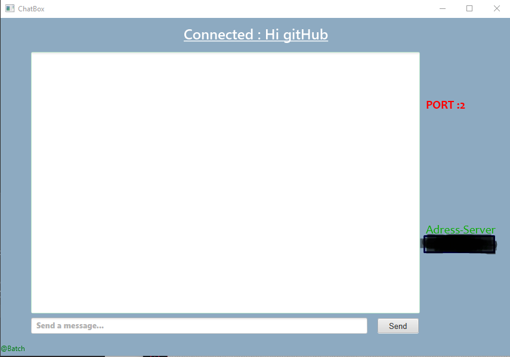

# ChatBox

A simple ChatBox made with JavaFX.

It has a SERVER and the CLIENT

# Server 💻

Before using the ChatBox, you have to connect to a server.

If a server is not started, you can started your own server.

Just enter a port then you can Start the Server.

# Client 

To use the chatBox, you have to enter a pseudonyme, a server-PORT and a server-ADDRESS

You need to enter the same PORT as used by the Server and the ADDRESS that the server uses.

If you don't know the address, with the camputer where you launch the server, start the CMD.exe and write :

__ipconfig__

It is gonna be IPv4 Address : (address)

What the application looks like :

